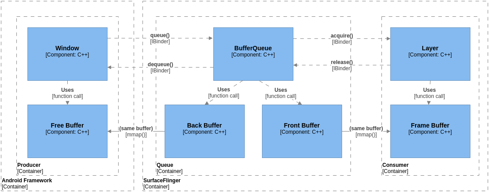

# 重大技术决策
* * *

本文用容器图(Container)体现 Android 图形系统的一些重大技术决策。

# 采用硬件加速

从前面的语境图可知，Android 图形系统是基于硬件加速模块进行设计的。更具体的说，Android 图形系统，是针对多核、异构的硬件进行设计的。
* CPU 有多核，所以可以设计多线程/进程协作架构。
* 能够绘图的设备有 CPU / GPU / codec / camera 等。
* 能够合成(Composition)图像的设备有 CPU / GPU / HWComposer。
* 需要考虑并发设计，以便使得挂在从绘图到显示这个路径上的各个设备都可以满负荷工作。减少设备忙等待的时间。

# 采用本地渲染策略

Android 图形系统的另外一个重大技术决策是采用本地渲染策略。在传统的图形系统中，例如 X Server，采用的是集中服务的策略，也就是在 Grahpic Server 一端做完所有一切。这样做的问题是服务器一端的软件又负责又不可靠，并且不能满足客户端各式各样并且求新求变的需求。

Android 图形系统将绘图算法库移动到客户端，由应用软件选择和自行调用。这样的好处有： 
* Grahpic Server 只实现合成功能，它就可以变小而易于维护，而绘图算法库可以单独升级而不影响服务器。 
* 应用软件可以按照需求，选择合适的图形库，例如，选择 cairo / skia / hwui 等图形库。 

最终，Android 图形系统在设计上最基本的思路和功能就是： 
* 客户端完成绘图或渲染功能。特点是采用 GPU 绘图或渲染，为此在 EGL / OpenGLES 方面提供了基于 Android 的扩展。经典的实现是 skia 和 hwui 库。 
* 服务端实现完整的合成功能。标志是提供了完整的矩阵变换、Porter-Duff 合成算法、颜色空间转换功能。 

# 面向 BufferQueue 的设计

图形系统的直接操作对象是窗口(Window)。

这是一种对称设计，在 Client 端有一个窗口(Window)的抽象，在 Server 端有一个 Layer 对应。Android 图形系统总体上是一种 Client / Server 架构，在设计模式上是 Producer-Consumer 模式，由 Client 端生产内容，由 Server 端消费内容。

我们针对窗口系统的 Producer-Consumer 模式进行细化。我们先看在图形系统中一个窗口的抽象设计。见下图。

一个窗口一般会分成两个部分：一个窗口本身的管理结构(struct)，一个是可以存放绘图内容的内存块，一般称为缓冲区(buffer)。在习惯上，一般在讨论这块内存本身的特性和功能时，会称之为缓冲区(buffer)；如果内存上面已经带有内容，则称之为帧(frame)。 

Android 图形系统是多线程/进程协作架构，为了使得 Client / Server 两端时刻都满负荷运作而不陷入忙等待，所以，在窗口系统的设计中，采用双缓冲(double-buffer)是很自然的事情。在双缓冲(double-buffer)方案里： 
* 一个窗口的有两个缓冲区(Buffer)：front buffer & back buffer。 
* 客户端把刚刚渲染完的帧(Frame)标记为 front buffer，另一个 buffer 等服务端合成完以后则为 back buffer。客户端在 back buffer 进行新的渲染。
* 为了管理多个 buffer，在流水线中间插入一个管理队列(Queue)，形成 Producer-Queue-Consumer 模式。
* 在每一个显示周期，两者通过 BufferQueue 交换 front buffer & back buffer。

为了尽快得到消息，设计模式的组合

Free Buffer 的微妙含义。

触发条件，两种频率，执行顺序。

相位差

# Buffer 的状态机

流水线上的状态机

# 2-stage 流水线

窗口合成示意图

显示流水线

# 性能(Performance)指标

# 可移植性(Portability)的实现

设计模式，访问者模式(Visitor Pattern)

# 编舞者(Choreographer)的设计

# 对称设计

